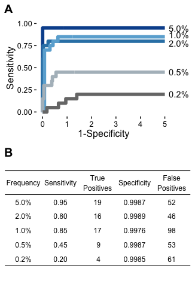

Benchmarking figures
================

    ## Warning: package 'ggplot2' was built under R version 3.2.4

    ## Warning: package 'gridExtra' was built under R version 3.2.4

    ## Warning: package 'cowplot' was built under R version 3.2.5

### Figure 2

    ## quartz_off_screen 
    ##                 2

### Figure 3

    ## [1] 40104

    ## quartz_off_screen 
    ##                 2

### Figure 4

    ## quartz_off_screen 
    ##                 2

    ## quartz_off_screen 
    ##                 2

    ## quartz_off_screen 
    ##                 2

### Figure 5

    ## [1] 0.4072225

    ## quartz_off_screen 
    ##                 2

### Figure 6

    ## [1] 53

### Figure 7

    ## quartz_off_screen 
    ##                 2

### Figure 8

### Table 1.

    ## % latex table generated in R 3.2.3 by xtable 1.8-2 package
    ## % Tue May 10 17:14:46 2016
    ## \begin{table}[ht]
    ## \centering
    ## \begin{tabular}{cccccc}
    ##   \hline
    ## Frequency &  & Expected & DeepSNV modified & Lofreq & DeepSNV \\ 
    ##   \hline
    ##  & Richness & 20 & 21 & 71 & 269 \\ 
    ##   5.0\% & Entropy & 2.97e-04 & 2.77e-04 & 3.35e-04 & 1.6e-03 \\ 
    ##    & L1-norm & 0 & 0.378 & 0.519 & 4.006 \\ 
    ##    \hline
    ##  & Richness & 20 & 39 & 115 & 120 \\ 
    ##   1.0\% & Entropy & 8.38e-05 & 7.3e-05 & 2.78e-04 & 3.14e-04 \\ 
    ##    & L1-norm & 0 & 0.133 & 2.702 & 0.704 \\ 
    ##    \hline
    ##  & Richness & 20 & 12 & 62 & 217 \\ 
    ##   0.5\% & Entropy & 4.71e-05 & 2.1e-05 & 8.47e-05 & 1.12e-03 \\ 
    ##    & L1-norm & 0 & 0.089 & 0.196 & 3.156 \\ 
    ##   \end{tabular}
    ## \end{table}

Table 2
-------

Other analysis
--------------

    ## R version 3.2.3 (2015-12-10)
    ## Platform: x86_64-apple-darwin13.4.0 (64-bit)
    ## Running under: OS X 10.10.5 (Yosemite)
    ## 
    ## locale:
    ## [1] en_US.UTF-8/en_US.UTF-8/en_US.UTF-8/C/en_US.UTF-8/en_US.UTF-8
    ## 
    ## attached base packages:
    ##  [1] grid      stats4    parallel  stats     graphics  grDevices utils    
    ##  [8] datasets  methods   base     
    ## 
    ## other attached packages:
    ##  [1] xtable_1.8-2        knitr_1.12.27       png_0.1-7          
    ##  [4] gtable_0.2.0        cowplot_0.6.2       gridExtra_2.2.1    
    ##  [7] pROC_1.8            reshape2_1.4.1      Biostrings_2.36.4  
    ## [10] XVector_0.8.0       IRanges_2.2.9       S4Vectors_0.6.6    
    ## [13] BiocGenerics_0.14.0 plyr_1.8.3          ggplot2_2.1.0      
    ## 
    ## loaded via a namespace (and not attached):
    ##  [1] Rcpp_0.12.4      magrittr_1.5     zlibbioc_1.14.0  munsell_0.4.3   
    ##  [5] colorspace_1.2-6 stringr_1.0.0    tools_3.2.3      htmltools_0.3.5 
    ##  [9] yaml_2.1.13      digest_0.6.9     formatR_1.3      codetools_0.2-14
    ## [13] evaluate_0.9     rmarkdown_0.9.6  labeling_0.3     stringi_1.0-1   
    ## [17] scales_0.4.0
